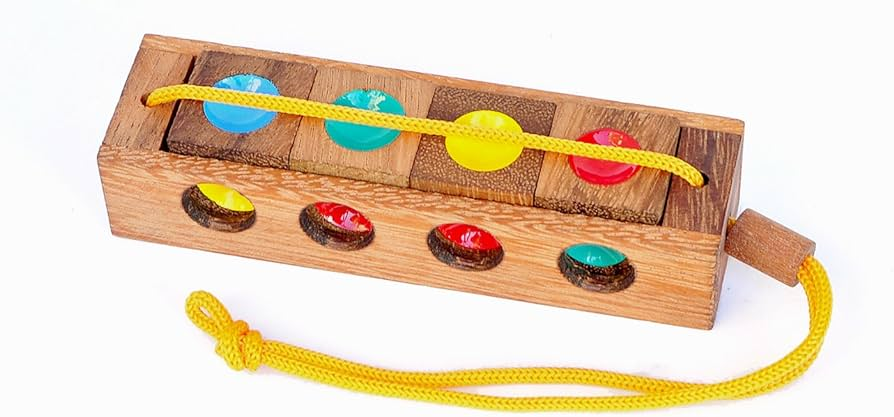

# Traffic Light Wooden Puzzle Solver

This python script, given the current state of your puzzle, will find a solution and return back the position of each cube to solve the puzzle. 

# How it works?

Open up the file 'solve.py' and modify each cube to reflect the colours of your puzzle in it's current state. Once you have that, save it and run it. Should take you no longer than 1 second to solve.

## Contributors
- Toby Killen - [@tobykillen](https://github.com/tobykillen)